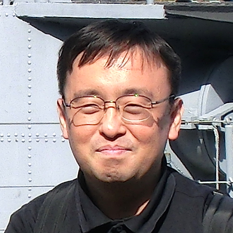

footer: Kenji Rikitake / oueees 201707 intro
slidenumbers: true

# [fit]  電気工学特別講義
# [fit] 2017年6月[13,20,27]日
# [fit] イントロダクション

<!-- Use Deckset 1.4, Next theme, 4:3 aspect ratio -->

---

# [fit] OU EE ES Lecture Series
# [fit] June [13, 20, 27], 2017
# [fit] Lecture introduction

---

## Kenji Rikitake

## りきたけ けんじ

## 力武 健次

13-JUN-2017
School of Engineering Science
Osaka University
Toyonaka, Osaka, Japan
@jj1bdx

---

# [fit] Who I am
# [fit] 自己紹介

---

# [fit] Professional
# [fit] Internet
# [fit] Engineer

---

# [fit] 技術士
#（情報工学部門）
# [fit] 力武健次技術士事務所 所長

---

# Guest Researcher at Pepabo R&D Institute, GMO Pepabo, Inc.
# [fit] GMOペパボ株式会社 ペパボ研究所 客員研究員

---

Working on: Erlang, Elixir, C, FreeBSD, TCP/IP, PHP, mruby, C#, Moodle, macOS, Windows, Vim, Emacs, Arduino, AVR, radio, music, distributed systems, fault tolerance, whatever.

27 years in Computer Science, 12 years since PhD, 41 years of ham radio op as @jj1bdx, 2010-2012: Professor, ACCMS/IIMC, Kyoto University, whatever.

... those past records are completely meaningless unless *you are working on what you really want to do right now*. So **ignore them**.

---

# [fit] Lecture theme

---

# Failed computer networks

---

# [fit] *Failed?*

---

# Yes, about *failed* systems.

---

# Modern life is full of failures

---

# How computer networks fail?

---

# [fit] False assumption 1:

# everything can be *shared without errors*

---

# [fit] False assumption 2:

# everything can be *distributed without errors*

---

# [fit] False assumption 3:

# *people can correctly use computer networks*

---

# [fit] Summary

# Sharing fails
# Distribution fails
# People go wrong

---

# OK let's get down to business!
