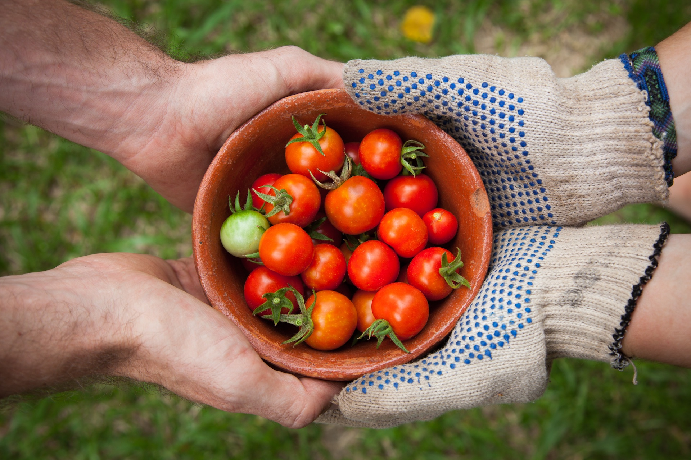
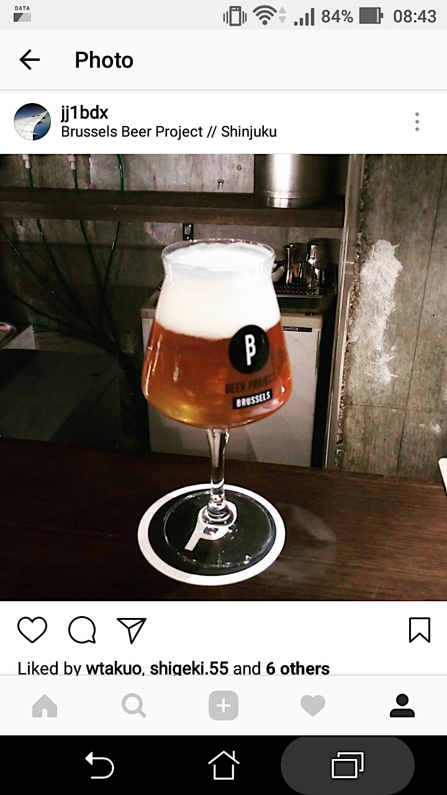

autoscale: true
footer: Kenji Rikitake / oueees 201706 part 1 13-JUN-2017
slidenumbers: true

# oueees-201706 Part 1: Tragedy of sharing

<!-- Use Deckset 1.4, Next theme, 4:3 aspect ratio -->

---

# Kenji Rikitake

13-JUN-2017
School of Engineering Science
Osaka University
Toyonaka, Osaka, Japan
@jj1bdx

---

# Lecture notes on GitHub

* [https://github.com/jj1bdx/oueees-201706-public/](https://github.com/jj1bdx/oueees-201706-public/)
* Don't forget to *check out the issues*!

---

# [fit] Sharing

---

# Share (v.)[^1]

Have/give a portion of (something) with another or others

Use, occupy, or enjoy (something) jointly with another or others

Possess (a view or quality) in common with others

[^1]: New Oxford American Dictionary, macOS 10.12.5

---

# More on share (v.)[^2]

Tell someone about (something), *especially something personal*

**Post or repost (something) on a social media website or application**

[^2]: New Oxford American Dictionary, macOS 10.12.5, emphasis by Kenji Rikitake

---

---

[.autoscale: true]

Photo credits:

* Title: Alissa Eady, from Unsplash.com
* Sharing: Elaine Casap, from Unsplash.com
* more on share: Kenji Rikitake, from his Instagram account

<!-- coding: utf-8 -->
<!-- End: -->
