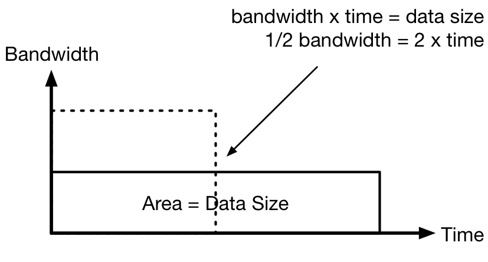

autoscale: true
footer: Kenji Rikitake / oueees 201706 part 1 13-JUN-2017
slidenumbers: true


# oueees-201706 Part 1: Tragedy of sharing

<!-- Use Deckset 1.4, Next theme, 4:3 aspect ratio -->

---

# Kenji Rikitake

13-JUN-2017
School of Engineering Science
Osaka University
Toyonaka, Osaka, Japan
@jj1bdx

---

# Lecture notes on GitHub

* [https://github.com/jj1bdx/oueees-201706-public/](https://github.com/jj1bdx/oueees-201706-public/)
* Don't forget to *check out the issues*!

---


# [fit] Sharing

---

# Share (v.)[^1]

Have/give a portion of (something) with another or others

Use, occupy, or enjoy (something) jointly with another or others

Possess (a view or quality) in common with others

[^1]: New Oxford American Dictionary, macOS 10.12.5

---


# More on share (v.)[^2]

Tell someone about (something), *especially something personal*

**Post or repost (something) on a social media website or application**

[^2]: New Oxford American Dictionary, macOS 10.12.5, emphasis by Kenji Rikitake

---

# [fit] Purposes of sharing:
# Showing off
# and
# Saving resources

---


# Showing off

* **Publicly bragging**
* **Addiction for Approval**
* **「私かわいい」**
* ... and various other psychological reasons
* **Creating a lot of social problems**
* **To be discussed in Part 3**

---


# Sharing on programming

---


# Historical background on computing resources

* **CPU speed**
* **Memory**
* **Storage**
* **Network bandwidth**
* **...All always on shortage**

---

# Sharing, programming and memory

* Memory is expensive: *explicit* allocation required
* Variables are *mutable*
* Internal state is *commonly shared* and accessible between multiple functions and modules
* Use *memory pointers* to minimize the number of copying, inherently suggesting: *share as much as you can*

---

# Question: is sharing *intuitive*?

---

# In JavaScript (node.js)

```javascript
// var a = {first: 1, second: 2}
// b = a // only share pointer
{ first: 1, second: 2 }
// a.second = 3
3
// b // element is shared
{ first: 1, second: 3 }
// b == { first: 1, second: 3 }
false // WHY?
```

---

# Copying *by default*, *not* sharing, can solve this issue

---

# In Elixir (v1.4.4)

```elixir
iex(1)> a = %{first: 1, second: 2}
%{first: 1, second: 2}
iex(2)> b = a # copying the map
%{first: 1, second: 2}
iex(3)> a = %{a | second: 3}
%{first: 1, second: 3} # member modified
iex(4)> b # not shared with a
%{first: 1, second: 2}
iex(5)> b == %{first: 1, second: 2}
true # intuitive!
```

---

# Thought: sharing is *not necessarily intuitive*

---

# Issues of sharing-based programming languages

* Access violation between multiple programs
* Zombie memory area without ownership
* Need for explicit copying cause bugs
* Mutable states are difficult to debug
* Semantically sharing is a *shortcut* and breaks many logical assumptions

---


# Sad news: most languages work like JavaScript (or C++, C#, Java) - so  be careful!

---


# False assumptions on sharing over networks

---

# 1-4 of Eight Fallacies of Distributed Computing[^3]

* **The network is reliable**
* **Latency is zero**
* **Bandwidth is infinite**
* The network is secure

[^3]: <https://blog.fogcreek.com/eight-fallacies-of-distributed-computing-tech-talk/>

---

# 5-8 of Eight Fallacies of Distributed Computing[^4]

* Topology doesn't change
* There is one administrator
* Transport cost is zero
* The network is homogeneous

[^4]: <https://blog.fogcreek.com/eight-fallacies-of-distributed-computing-tech-talk/>

---

# The network is *not* reliable

* Somebody breaks the link (cut the line/fiber)
* Error rate of wireless/radio communication is far higher than the wired communication
* Data over the network *may* be altered without being discovered

---

# Latency is *not* zero

* Speed of light: ~300,000km/s
* = only **~30cm/ns**, **~300km/ms**
* Even slower on the optic fiber (**~x0.7**)[^5]
* Japan-US West Coast: **~0.1s** for round-trip
* **Light is SLOW**

[^5]: <https://physics.stackexchange.com/questions/80043/how-fast-does-light-travel-through-a-fibre-optic-cable>

---

# Bandwidth is *limited*

* 1Gbps on Ethernet: ~100Mbytes/sec
* **32Gbytes takes 32 seconds** on Ethernet
* **32Gbytes takes ~54 minutes** on ~1Mbytes/sec link
* **Replication of pictures and videos takes minutes or even hours**

---

# Bandwidth and latency



---

# Implications

* What you think you have successfully shared over the network **might be delivered corrupted** or **would not be delivered at all**
* **Sharing might not be completed as you expect**, especially regarding network errors
* **Data delivery delays**

---


# [fit] Themes on part 2:
# [fit] Distributed systems
# [fit] Concurrency
# [fit] Consistency .vs availability

---
[.autoscale: true]

Photo credits:

* All photos are modified and edited by Kenji Rikitake
* Photos are from Unsplash.com unless otherwise noted

* Title: Alissa Eady
* Sharing: Elaine Casap
* More on share: [Kenji Rikitake from Instagram](https://www.instagram.com/p/BUG6XGDh7Z9/)
* Showing off: Anthony Delanoix
* Sharing on programming: Matthew Henry
* Historical background on computing resources: Damjan Dobrilla
* Sad news: Ben White
* False assumptions on sharing over networks: Fré Sonneveld
* Themes on part 2: Redd Angelo

<!-- coding: utf-8 -->
<!-- End: -->
