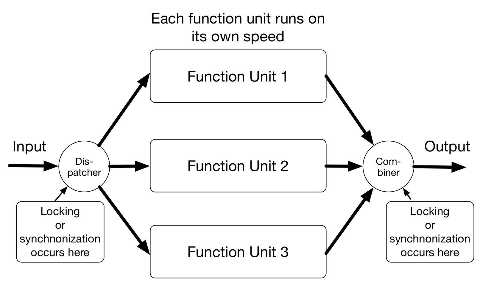

autoscale: true <!-- -*- coding: utf-8 -*- -->
footer: Kenji Rikitake / oueees 201706 part 2 20-JUN-2017
slidenumbers: true

# oueees-201706 Part 2: Distributed system fiasco

<!-- Use Deckset 1.8,1, Next theme, 4:3 aspect ratio -->

---

# Kenji Rikitake

20-JUN-2017
School of Engineering Science
Osaka University
Toyonaka, Osaka, Japan
@jj1bdx

Copyright © 2017 Kenji Rikitake.
This work is licensed under a [Creative Commons Attribution 4.0 International License](https://creativecommons.org/licenses/by/4.0/).

---

# Lecture notes on GitHub

* [https://github.com/jj1bdx/oueees-201706-public/](https://github.com/jj1bdx/oueees-201706-public/)
* Don't forget to *check out the issues*!

---

# Some thoughts on Part 1 report answers

* **You can program or write code**
* Sharing requires synchronization
* Social sharing is another issue
* *Reusing* software is not sharing
* **Decoupling is hard**

---

# [fit] Modern computing
## is
# [fit]cloud computing

---

---

# Is cloud really a uniform and single entity?

---

# Absolutely not: it's an intertwined *network* of computers

---

# Web services are clusters of computers and networks

**Thousands or millions of servers connected together**

**A physical server is separated into multiple virtual machines**

---

# [fit] Networks

---

# Example of networks connecting multiple nodes

Reference: Baran, Paul. On Distributed Communications: I. Introduction to Distributed Communications Networks. Santa Monica, CA: RAND Corporation, 1964. <https://www.rand.org/pubs/research_memoranda/RM3420.html>. Figure 1 in Chapter 1.

All figures drawn by Kenji Rikitake

---

# Centralized network

All nodes are connected to the single core

One hop to the core

Two hops between non-core nodes

No communication path between the nodes if the core fails

---

# Decentralized network

A few nodes are connected to the core

Some nodes are connected to local concentrated nodes

Hierarchical structure

---

# Distributed network

No core exists anymore

No hierarchical structure

Multiple redundant paths are available between two nodes

Many hops are required to reach between two nodes

---

# [fit] Networks *split*

---

---

# [fit] Partition tolerance

## Distributed systems should not stop working even if netsplit occurs

---

# [fit] Consistency
# .vs.
# [fit] Availability

---

# Data store requirements[^1]

**Consistency: all clients get responses to requests that make sense**

**Availability: all operations eventually return successfully**

**Partition Tolerance: system works even under network split**

[^1]: [CAP Confusion: Problems with 'partition tolerance', Cloudera Engineering Blog](http://blog.cloudera.com/blog/2010/04/cap-confusion-problems-with-partition-tolerance/)

---

# Partition happens

**Consistent under partition: resynchronize after partition ends** (unavailable before synchronization)

**Available under partition: data between partitioned subsystems will be inconsistent** (consistency to be recovered when partition ends)

... **mutually conflicting**

---

# If consistency and availability are both required, then...

**Consistent and available system should not include networks within**

(In large-scale systems this kind of assumption is practically not feasible)

---

---

# [fit] Concurrency

## Real world is concurrent

### Actions independently happen
### No strict synchronization
### Actions simultaneously happen

---

---

# False assumptions on concurrent programming

* **Sequences are preserved**
* **Sequences are predictable**
* **All data are available before a time limit**
* **All operations complete before a time limit**
* **All functions are operational at any time**
* ... and more issues not described here

---

# Implications

* **Distributed systems are mutually dependent with each other**
* **A node failure may cause a total system failure at once if badly designed**
* **Concurrency is hard**
* **Satisfying consistency and availability is even harder**

---

# [fit] Themes on part 3:
# [fit] How large systems fail
# [fit] Fallacies of teamwork
# [fit] Centralized power
## .vs.
# [fit] individual freedom

---
[.autoscale: true]

Photo and figure credits:

* All photos are modified and edited by Kenji Rikitake
* Photos are from Unsplash.com unless otherwise noted

* Title: NASA
* Modern Computing is Cloud Computing: Rayi Christian Wicaksono
* Cloud Computing: <https://commons.wikimedia.org/wiki/File:Cloud_applications_SVG.svg>, licensed under [Creative Commons CC0 1.0 Universal Public Domain Dedication](https://creativecommons.org/publicdomain/zero/1.0/deed.en)
* Intertwined network of computers: <https://en.wikipedia.org/wiki/File:Cloud_Computing.jpg>, licensed under [Creative Commons CC0 1.0 Universal Public Domain Dedication](https://creativecommons.org/publicdomain/zero/1.0/deed.en)
* Web services are clusters of computers: Kenji Rikitake, at Kyoto University ACCMS, April 2017
* Networks: Irina Blok
* Networks Split: Pietro De Grandi
* Netsplit: <https://commons.wikimedia.org/wiki/File:Netsplit_split.svg>, in public domain
* Concurrency: Daria Shevtsova
* Themes on part 3: Redd Angelo

<!-- coding: utf-8 -->
<!-- End: -->
