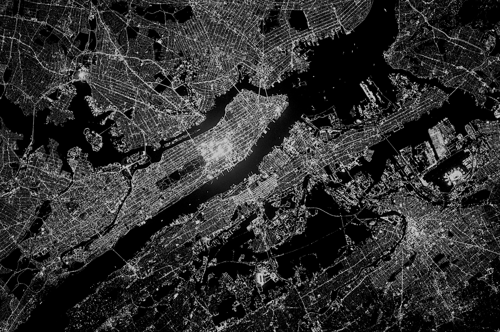
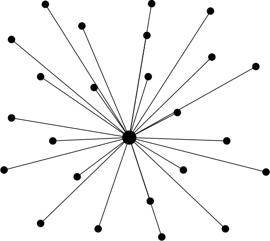

autoscale: true
footer: Kenji Rikitake / oueees 201706 part 2 20-JUN-2017
slidenumbers: true

# oueees-201706 Part 2: Distributed system fiasco

<!-- Use Deckset 1.8,1, Next theme, 4:3 aspect ratio -->

---

# Kenji Rikitake

20-JUN-2017
School of Engineering Science
Osaka University
Toyonaka, Osaka, Japan
@jj1bdx

Copyright ©2017 Kenji Rikitake.
This work is licensed under a [Creative Commons Attribution 4.0 International License](https://creativecommons.org/licenses/by/4.0/).

---

# Lecture notes on GitHub

* [https://github.com/jj1bdx/oueees-201706-public/](https://github.com/jj1bdx/oueees-201706-public/)
* Don't forget to *check out the issues*!

---

---

# Example of multi-node networks

Source: Baran, Paul. On Distributed Communications: I. Introduction to Distributed Communications Networks. Santa Monica, CA: RAND Corporation, 1964. <https://www.rand.org/pubs/research_memoranda/RM3420.html>. Figure 1.

All figures drawn by Kenji Rikitake

---

# Centralized network

All nodes are connected to the single core

One hop to the core

Two hops between non-core nodes

No communication path between the nodes if the core fails

---

# Decentralized network

A few nodes are connected to the core

Some nodes are connected to local concentrated nodes

Hierarchical structure

---

# Distributed network

No core exists anymore

No hierarchical structure

Multiple redundant paths are available between two nodes

---
[.autoscale: true]

Photo credits:

* All photos are modified and edited by Kenji Rikitake
* Photos are from Unsplash.com unless otherwise noted

* Title: NASA

<!-- coding: utf-8 -->
<!-- End: -->
