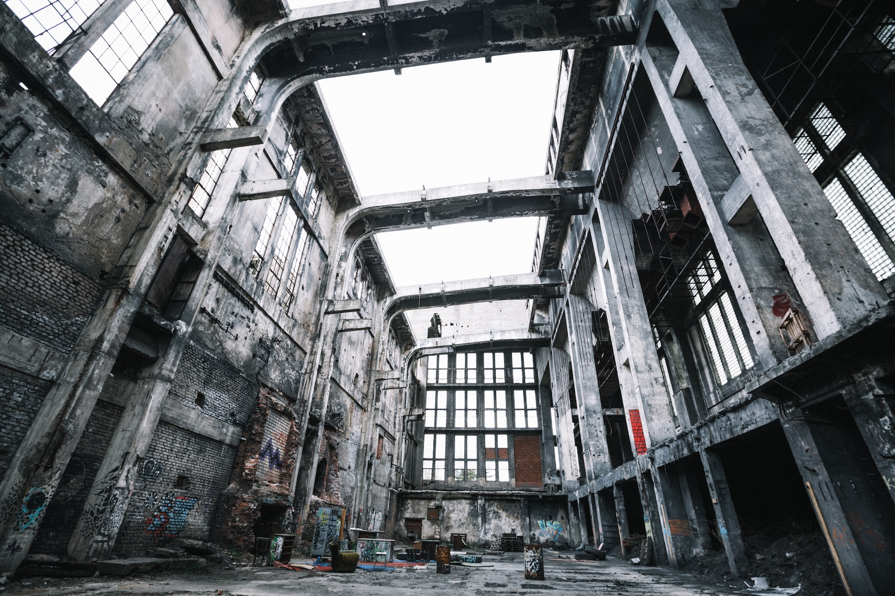

autoscale: true <!-- -*- coding: utf-8 -*- -->
footer: Kenji Rikitake / oueees 201706 part 3 27-JUN-2017
slidenumbers: true
theme: Next, 1

# oueees-201706 Part 3: Negligence of people

<!-- Use Deckset 1.8,1, Next theme, 4:3 aspect ratio -->

---

# Kenji Rikitake

27-JUN-2017
School of Engineering Science
Osaka University
Toyonaka, Osaka, Japan
@jj1bdx

Copyright © 2017 Kenji Rikitake.
This work is licensed under a [Creative Commons Attribution 4.0 International License](https://creativecommons.org/licenses/by/4.0/).

---

# Lecture notes on GitHub

* [https://github.com/jj1bdx/oueees-201706-public/](https://github.com/jj1bdx/oueees-201706-public/)
* Don't forget to *check out the issues*!

---

# Some thoughts on Part 2 report answers

* Internet and DNS: eventually consistent
* Concurrency = asynchronicity
* Eventual = allowing timeframe variance
* Redundancy: more availability

---

# [fit] Negligence of people
# [fit] Risks of computer systems
# [fit] caused by human errors

---

# [fit] Illusion of *distributed* systems:
# [fit] how large systems fail

---

# Case study: Mizuho Bank on April 2002 (1/4) [^1]

* **Failed transactions** on merging 3 banks
* Duplicated transactions also observed
* **Planned since December 1999**, implementation details changed many times
* Single point of failure at the *Relay Computer*

[^1]: [失敗知識データベース: みずほファイナンシャルグループ大規模システム障害](http://www.sozogaku.com/fkd/cf/CA0000623.html)

---

# Case study: Mizuho Bank on March 2011 (2/4) [^2]

* **~1.2M unprocessed transactions** on 17-MAR-2011; ATM closed for 3 days to complete the batch during 19~21 MAR-2011[^3]
* **Cascaded failures** by interrupted and duplicated batch operations

[^2]: [みずほ銀障害の全貌判明、懸案はCIO人事 - 第1回 重なった30の不手際 (ITpro)](http://itpro.nikkeibp.co.jp/article/COLUMN/20110607/361134/), [第2回 読み誤りや誤削除など人為ミス続発](http://itpro.nikkeibp.co.jp/article/COLUMN/20110607/361135/)

[^3]: [みずほ銀行: 2011年3月のシステムトラブル (Wikipedia) ](https://ja.wikipedia.org/wiki/みずほ銀行#2011.E5.B9.B43.E6.9C.88.E3.81.AE.E3.82.B7.E3.82.B9.E3.83.86.E3.83.A0.E3.83.88.E3.83.A9.E3.83.96.E3.83.AB)

---

# Case study: Mizuho Bank as of 2016 (3/4) [^4]

* Integration project initiated in 2012
* Scandal of relationship with organized crimininals revealed on September 2013[^5]
* Integration project deadline delayed from March 2016 to December 2016

[^4]: [Akio's Log - みずほ銀行次期システム関連のまとめ](http://elwoodblues.hatenablog.com/entry/20160706/1467806420)

[^5]: [みずほ銀行暴力団融資事件](https://ja.wikipedia.org/wiki/みずほ銀行暴力団融資事件)

---

# Case study: Mizuho Bank as of 2017 (4/4)

* Still recruiting software engineers (May 2017) [^6]
* Project completion by Summer 2017 announced; testing and implementation will take 1 to 1.5 years[^7]

[^6]: [ジョブダイレクト: みずほ情報総研株式会社の求人(2017年5月掲載)](http://www.jobdirect.jp/shigoto/c/j/0015795915)

[^7]: [みずほ銀行の次期システムが今夏にも完成との報道、稼働は18年度以降(ITpro 2017/05/08)](http://itpro.nikkeibp.co.jp/atcl/news/17/050801345/)

---

# Why failed?

## [fit] No corporate governance
## [fit] No software engineering skills
## [fit] No project management skills
## [fit] Pervasive complacency
## [fit] Indifference and ignorance

---

# Question
## Can Mizuho Bank successfully complete the project this time?

---

# [fit] Fallacies of teamwork
# [fit] ... and other social issues

---

# [fit] Centralized power
## .vs.
# [fit] individual freedom

---
[.autoscale: true]

Photo and figure credits:

* All photos are modified and edited by Kenji Rikitake

* Title: Blair Fraser, from Unsplash.com
* Negligence of people: [An engraving by D. H. Friston of Gilbert and Sullivan's Trial by Jury, shortly after its première, via Wikimedia Commons, in public domain](https://commons.wikimedia.org/wiki/File:Trial_by_Jury_-_Chaos_in_the_Courtroom.png)
* Illusion of distributed systems: [LZ 129 Hindenburg burning at US NAS Lakehurst, by Gus Pasquarella (US Navy), via Wikimedia Commons, in public domain](https://commons.wikimedia.org/wiki/File:Hindenburg_burning,_1937.jpg)
* Why failed?: Hieu Vu Minh, from Unsplash.com
* Fallacies of teamwork: [geralt from pixabay.com](https://pixabay.com/en/exchange-of-ideas-debate-discussion-222788/)
* Centralized power .vs. individual freedom: [Eugène Delacroix, La liberté guidant le peuple, via Wikimedia Commons, in public domain](https://commons.wikimedia.org/wiki/File:Eugène_Delacroix_-_La_liberté_guidant_le_peuple.jpg)

<!-- coding: utf-8 -->
<!-- End: -->
